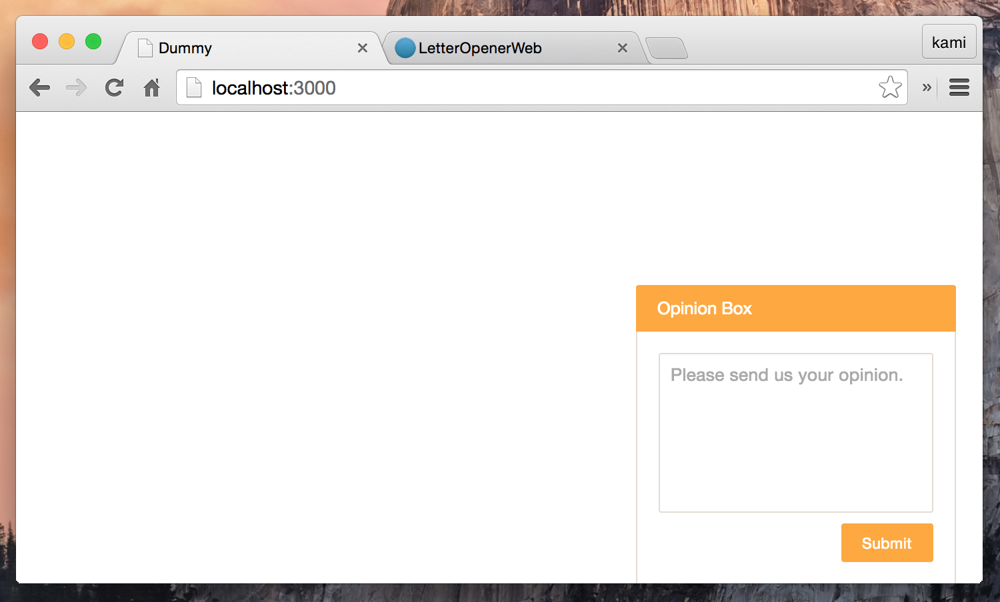

# Meyasubako

[](https://travis-ci.org/kami-zh/meyasubako)
[](http://badge.fury.io/rb/meyasubako)

Meyasubako provides easy to install opinion box for Rails application.
The submitted opinion is sent by ActionMailer.
Please look at following demo.

Meyasubako (目安箱) is "Opinion Box" in Japanese.

## Demo


## Installation

Add this line to your application's Gemfile:

```ruby
gem 'meyasubako'
```

And then execute:

```
$ bundle
```

## Usage

At first, you have to add `require` to your asset files.

In `app/assets/javascripts/application.js`:

```js
//= require meyasubako
```

In `app/assets/stylesheets/application.css`:

```css
/*
 *= require meyasubako
 */
```

Then, you can render opinion box using `render_meyasubako` method where you like in views.

```erb
<%= render_meyasubako %>
```

## Configuration

You can configure email's `to` and `from`.
To do this, create `config/initializers/meyasubako.rb` and add this lines:

```ruby
Meyasubako.configure do |config|
  config.to   = 'username@example.com'
  config.from = 'username@example.com'
end
```

## Customize

If you want to customize the theme color, set `$meyasubako-color` to your `app/assets/stylesheets/application.scss` like this:

```scss
/*
 *= require_tree .
 *= require_self
 */

$meyasubako-color: #ffa933;

@import 'meyasubako';
```



## Languages

Following languages are available.
If you want to add additional language, please send pull request :)

- [English](config/locales/en.yml)
- [Japanese](config/locales/ja.yml)

## Contributing

1. Fork it ( https://github.com/kami-zh/meyasubako/fork )
2. Create your feature branch (git checkout -b my-new-feature)
3. Commit your changes (git commit -am 'Add some feature')
4. Push to the branch (git push origin my-new-feature)
5. Create a new Pull Request
